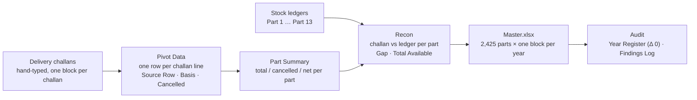
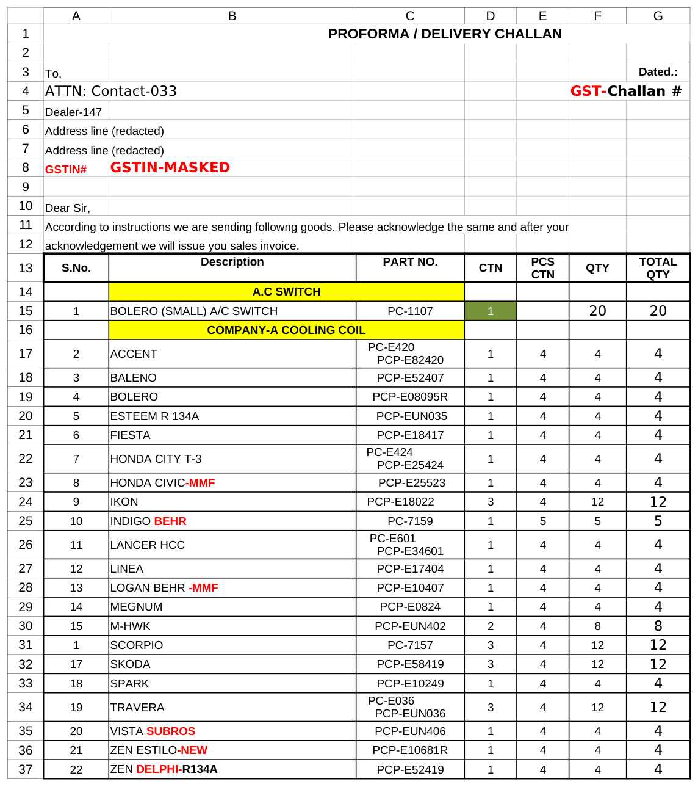
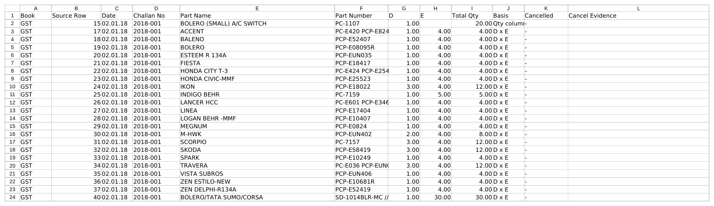
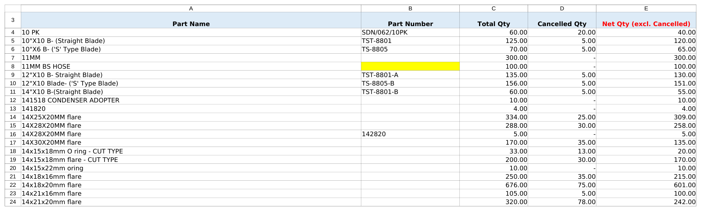
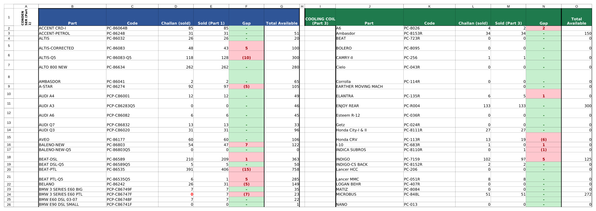
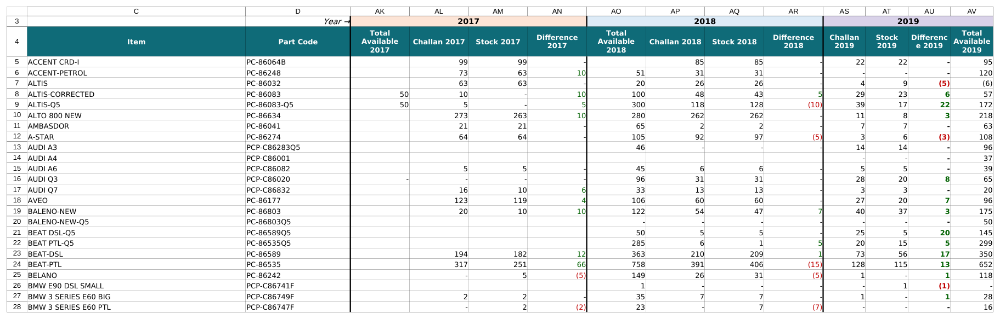
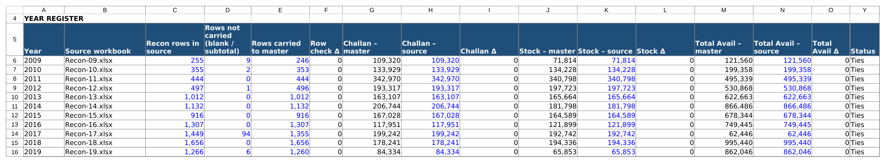
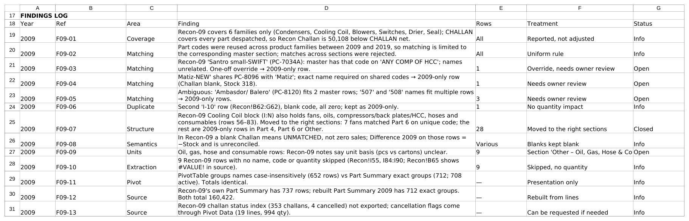

# Inventory Reconciliation 2009–2019

Eleven years of hand-typed delivery challans and stock ledgers, rebuilt into a traceable, part-level reconciliation in Excel. Every challan line is flattened and validated, cancellations are evidenced, each year's challan-vs-stock reconciliation is tied out, and all years are consolidated into one master with an audit register and findings log.

| 11 years | 63,360 challan lines | 2,425 parts | 116 findings logged | Δ 0 on every year |
|:---:|:---:|:---:|:---:|:---:|

**Stack:** Excel 365 · structured tables · pivot tables · formula-driven reconciliation · Git

## Pipeline



Each yearly workbook (`Recon-09.xlsx` … `Recon-19.xlsx`) runs the first four steps; `Master.xlsx` consolidates all eleven years and proves the tie-out.

## From raw challan to master: a 2018 walkthrough

All screenshots are taken from the published, anonymised workbooks.

### 1. Raw challan, as typed (`Recon-18.xlsx` › `Challan`)

GST-Challan 2018-001, dated 02.01.18. A header block (party, attention, address, GSTIN, all anonymised here) is followed by product bands (yellow) and item lines with cartons (`CTN`, column D) × pieces per carton (column E). The 2018 book is numbered 2018-001 to 2018-1167.



### 2. Flattened lines (`Pivot Data`)

Every item line becomes one row. `Source Row` points back to the challan row (row 15 is the BOLERO (SMALL) A/C SWITCH line above), `Basis` records the quantity rule applied (`D x E`, or the Qty column when cartons × pieces is not available), and `Cancelled` / `Cancel Evidence` carry the cancellation flag.



### 3. Totals per part (`Part Summary`)

Pivot Data grouped by part name and part number: total, cancelled and net quantity.



### 4. Year reconciliation (`Recon`)

One block per stock ledger (Condenser = Part 1, Cooling Coil = Part 3, …). For each part, `Challan (sold)` from the challans is compared with `Sold` from the ledger; `Gap` is green at zero and red otherwise, and `Total Available` comes from the ledger. Ambiguous rows are never force-matched.



### 5. Master (`Master.xlsx` › `Master`)

One row per part, one block per year (Total Available · Challan · Stock · Difference). Shown: the 2017, 2018 and 2019 blocks. The 2009–2016 columns are hidden for the screenshot, and the Section / Group columns are hidden in the workbook. Matching is limited to the same product section because part codes were reused across families; unmatched rows are kept as year-only rows.



### 6. Tie-out (`Audit` › Year Register)

Source workbook vs master for every year: rows, challan quantity, stock quantity and total available. Blue figures are typed from the source workbook; master figures are live `SUM`s over the master table. Every Δ is 0 and the `Status` formula reads *Ties* for all eleven years (columns P–X, the challan-line checks, are hidden for the screenshot).



### 7. Findings Log (`Audit`)

Every rule, exclusion and open question, with the rows affected, the treatment and a status. Items marked *Open* need an owner decision and were not silently adjusted.



## Results

All eleven years tie to the master with **Δ 0** on row count, challan quantity, stock quantity, total available and challan lines.

| Year | Recon rows | Challan qty | Stock qty | Challan lines loaded | Findings (open) | Tie-out |
|---|---:|---:|---:|---:|---:|---|
| [2009](docs/years/2009.md) | 246 | 109,320 | 71,814 | 1,911 | 13 (4) | ✅ Ties |
| [2010](docs/years/2010.md) | 353 | 133,929.35 | 134,228.18 | 2,670 | 14 (3) | ✅ Ties |
| [2011](docs/years/2011.md) | 444 | 342,970 | 340,798 | 2,499 | 15 (5) | ✅ Ties |
| [2012](docs/years/2012.md) | 496 | 193,317 | 197,723 | 4,031 | 10 (4) | ✅ Ties |
| [2013](docs/years/2013.md) | 1,012 | 163,107 | 165,664 | 4,531 | 10 (5) | ✅ Ties |
| [2014](docs/years/2014.md) | 1,132 | 206,744 | 181,798 | 5,416 | 11 (6) | ✅ Ties |
| [2015](docs/years/2015.md) | 916 | 167,028 | 164,589 | 7,325 | 10 (5) | ✅ Ties |
| [2016](docs/years/2016.md) | 1,307 | 117,951 | 121,899 | 6,138 | 12 (5) | ✅ Ties |
| [2017](docs/years/2017.md) | 1,355 | 199,242 | 192,742 | 11,830 | 11 (4) | ✅ Ties |
| [2018](docs/years/2018.md) | 1,656 | 178,241 | 194,336 | 11,300 | 5 (3) | ✅ Ties |
| [2019](docs/years/2019.md) | 1,260 | 84,334 | 65,853 | 5,709 | 5 (0) | ✅ Ties |

All 116 findings: [audit findings](docs/audit-findings.md).

## Workbooks

| Year | Workbook | Notes |
|---|---|---|
| 2009 | [`Recon-09.xlsx`](workbooks/Recon-09.xlsx) | [notes](docs/years/2009.md) |
| 2010 | [`Recon-10.xlsx`](workbooks/Recon-10.xlsx) | [notes](docs/years/2010.md) |
| 2011 | [`Recon-11.xlsx`](workbooks/Recon-11.xlsx) | [notes](docs/years/2011.md) |
| 2012 | [`Recon-12.xlsx`](workbooks/Recon-12.xlsx) | [notes](docs/years/2012.md) |
| 2013 | [`Recon-13.xlsx`](workbooks/Recon-13.xlsx) | [notes](docs/years/2013.md) |
| 2014 | [`Recon-14.xlsx`](workbooks/Recon-14.xlsx) | [notes](docs/years/2014.md) |
| 2015 | [`Recon-15.xlsx`](workbooks/Recon-15.xlsx) | [notes](docs/years/2015.md) |
| 2016 | [`Recon-16.xlsx`](workbooks/Recon-16.xlsx) | [notes](docs/years/2016.md) |
| 2017 | [`Recon-17.xlsx`](workbooks/Recon-17.xlsx) | [notes](docs/years/2017.md) |
| 2018 | [`Recon-18.xlsx`](workbooks/Recon-18.xlsx) | [notes](docs/years/2018.md) |
| 2019 | [`Recon-19.xlsx`](workbooks/Recon-19.xlsx) | [notes](docs/years/2019.md) |
| 2009–2019 | [`Master.xlsx`](workbooks/Master.xlsx) | [audit findings](docs/audit-findings.md) |

Details: [methodology](docs/methodology.md) · [data dictionary](docs/data-dictionary.md)

## Data privacy

These are real operational records, anonymised before publication: party names, contacts, addresses, tax IDs, phone numbers and prices are masked; quantities, dates, challan numbers and all formulas are unchanged. Each file passed a leak scan, a structure diff and a full recalculation diff against the original. See [anonymisation](docs/anonymisation.md).

## Repository layout

```
workbooks/     Recon-09.xlsx … Recon-19.xlsx, Master.xlsx
docs/          methodology, data dictionary, anonymisation, per-year notes, audit findings
docs/images/   README screenshots
```
